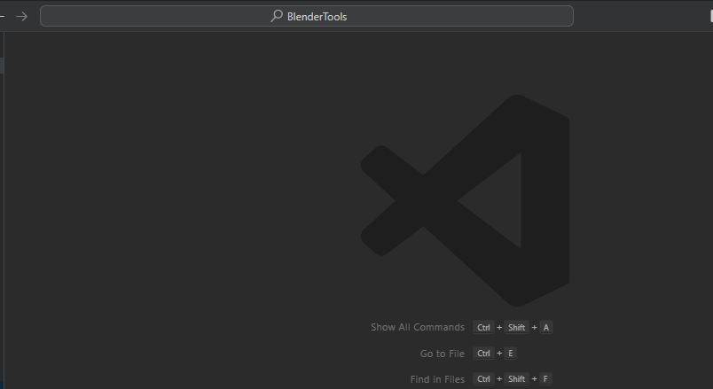
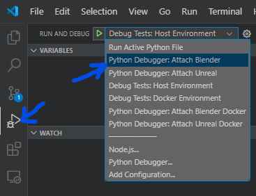

# Help Develop
When contributing to this repository, please first discuss the change you wish to make via issue,
with the owners of this repository, before making a change. Each pull request must first be an issue.

## Pull Request Process
1. Fork the repository.
1. Create a branch in your fork that matches the name of the issue you're working on.
1. Add the new feature or fix.
1. Run the unit tests and ensure that none fail.
1. Submit a pull request from your forked branch back to the `dev` branch of the repository.
1. Include the updated documentation in the pull request.
1. The pull request will be reviewed, then merged into `dev` if all tests pass, the changes will be pushed to the `master` branch and a new versioned build will be made.

!!! note
  
    Any new features require an accompanying unit test for it to be approved.


## Getting Setup
Fork the `BlenderTools` repository.


Create a branch in your fork with the name of the task/issue you are working on.


Clone your fork and checkout that branch:
```shell
git clone https://github.com/<your-username>/BlenderTools.git
cd BlenderTools
git checkout some-task-branch
```

## VSCode
The repo contains the tasks, launch actions, and settings for developing with vscode. To get setup do the following:

### Setup
1. Install the VSCode profile under `scripts/resources/profiles/dev.code-profile`. You can do this by typing `> Profile Import Profile` in the command pallette. This will give you all the vscode extensions you will need.
1. Close and re-open VSCode
1. Type `> Python: Create Environment`, hit enter and chose `Venv` and choose your Python 3.11 installation, then check the box to install the `requirements.txt`
1. Close and re-open your integrated terminal in vscode and ensure that you now have a `(.venv)` prefixing your shell. If you do, you are all setup and ready to go!

### Build Tasks
The VSCode project has build tasks for launch your apps. It is highly recommended that you launch blender and unreal through these, since they will ensure you have the dev dependencies in your python environment for reloading code and debugging. To do this move your cursor over the integrate terminal and press the hot keys `CTRL+SHIFT+B`. 



!!! note
    If you choose yes to debug, the app will hang until you attach to it via debugpy in VSCode. (See Launch Actions)

!!! note
    The launch scripts look for the unreal and blender executables in their default locations. You can override the exe paths by setting
    the `UNREAL_EXE_PATH`and `BLENDER_EXE_PATH` variables in a `.env` file in the repo root.

### Launch Actions
Several launch actions have been created for debugging. Use the `Python Debugger: Attach Blender` or `Python Debugger: Attach Unreal` to attach to the apps after they have been launched from the build tasks and have logged that they are waiting for the debugger to attach. There are also a few other debug configurations for the test cases as well.



## Reloading your changes
While developing, you will want to be able to rapidly test your new changes. You can do this by running this script in
the Blender Script Editor.

!!! note
  
    If your didn't launch from VSCode, You need to change `<your-repo-location>` to match the absolute path to the scripts folder in your local project. Running this script reloads the addon code.


```python
import sys
sys.path.append(r'C:\<your-repo-location>\BlenderTools\scripts')
import dev_helpers
dev_helpers.reload_addon_source_code(['send2ue', 'ue2rigify'])
```

In most cases you can get away with running `dev_helpers.reload_addon_source_code`, which reloads your addon code without restarting blender.


## Code Structure

This is how the addon code is structured. You will see this primary file and folder structure in each of the addons.


```txt
.
├── ...
├── send2ue             # The root folder for the plugin
│   ├── core            # This folder contains all the core logic of the tool.
│   ├── dependencies    # This folder contains dependencies that have been added into the tool.
│   ├── resources       # This folder contains templates, settings, and extensions.
│   ├── ui              # This folder contains all UI classes for the tool.
│   ├── __init__.py     # This contains the plugin and initialization and uninitialization calls for all operators, properties and events.
│   ├── constants.py    # This file holds hard coded values that the tool utilizes.
│   ├── properties.py   # This file contains the property data definition for the tool. All tool properties should live in here.
│   └── operators.py    # This file contains all operator class definitions. This serves as the entry point to all logic that lives in the core module.
└── ...
```
